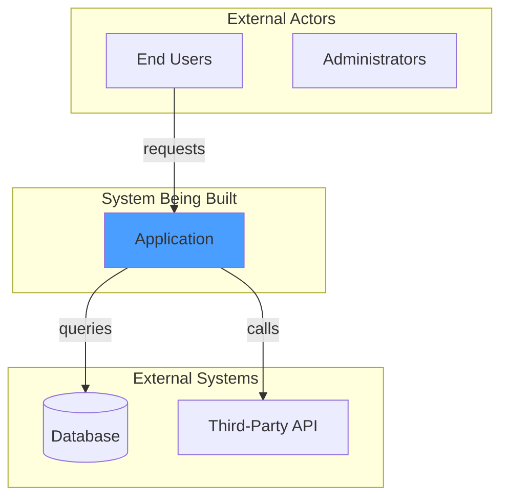
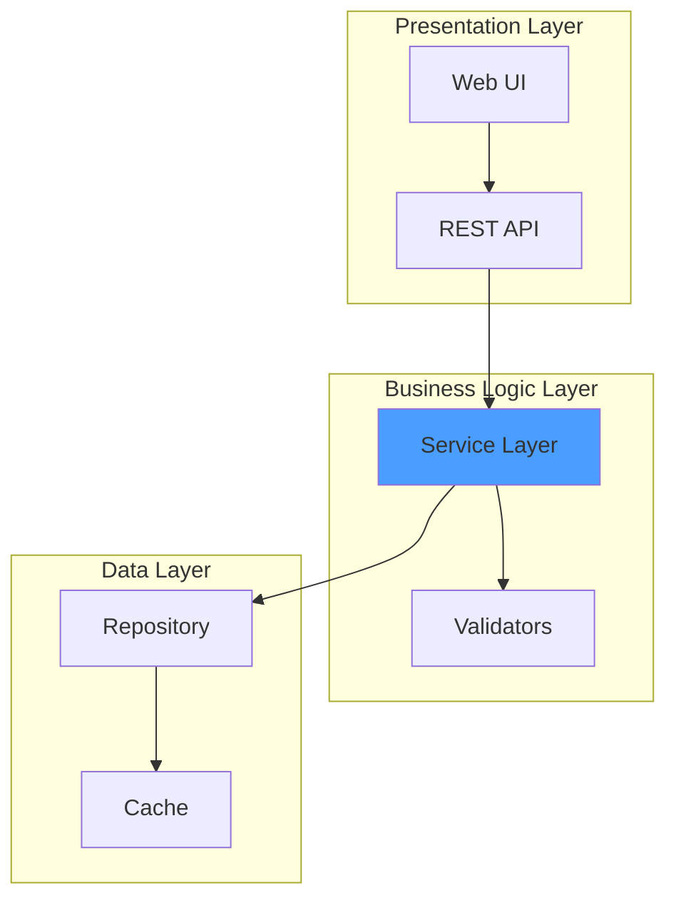
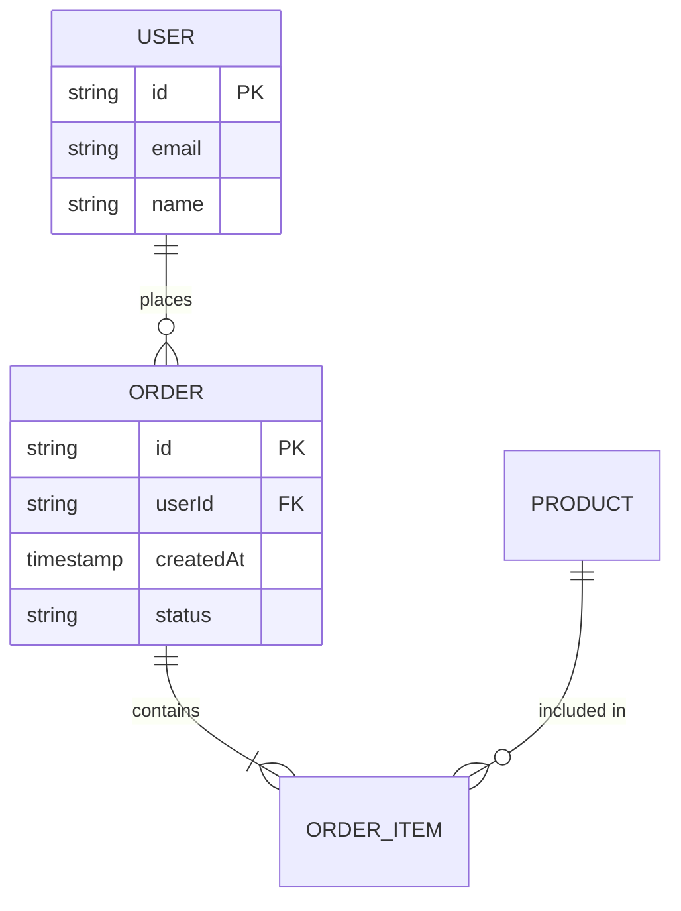
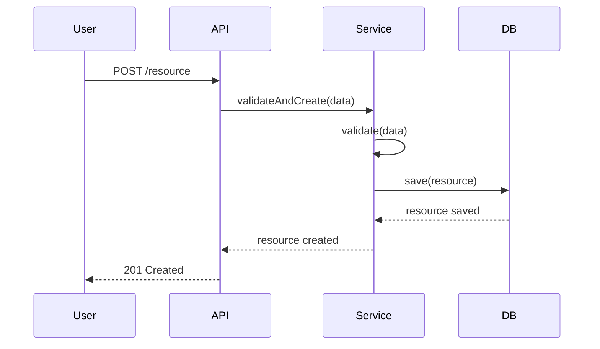
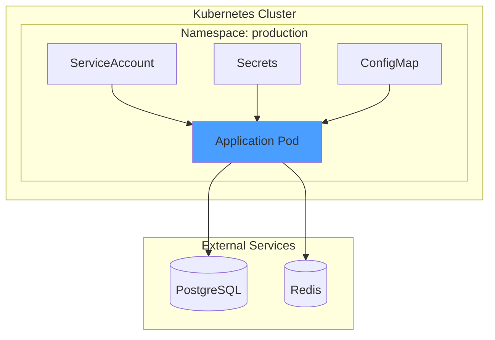
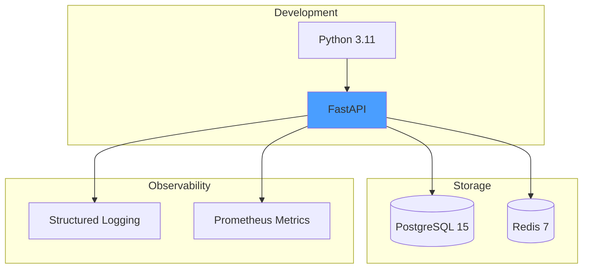

# Architecture Documentation: [Feature Name]

**Feature**: [Feature name from spec.md]
**Version**: 1.0
**Date**: [Current date]
**Status**: Design
**Input**: Specification documents from `[path/to/specs/folder]`

## Execution Flow (main)
```
1. Load prerequisite documents:
   → spec.md: Extract functional requirements, entities, user scenarios
   → data-model.md: Extract entities, relationships, state transitions
   → research.md: Extract technical decisions and integration patterns
   → plan.md: Extract technical context, dependencies, project structure
   → quickstart.md: Extract key user flows and test scenarios
   → If any missing: WARN "Limited architecture view - document [X] not found"

2. Generate System Context diagram:
   → Identify external actors from spec.md User Scenarios
   → Identify external systems from research.md integrations
   → Map data flows between actors, system, and external systems
   → Output: Mermaid graph TB diagram

3. Generate Component Architecture diagram:
   → Extract component layers from plan.md Project Structure
   → Map components to file structure (cmd/, pkg/, etc.)
   → Identify component dependencies and interactions
   → Output: Mermaid graph TB with subgraphs for layers

4. Generate Data Model diagrams:
   → Extract entities from data-model.md Core Entities section
   → Build Entity Relationship Diagram with cardinalities
   → For each entity with state transitions: Generate state machine diagram
   → Output: Mermaid erDiagram + stateDiagram-v2 for each state machine

5. Generate Key Flows sequence diagrams:
   → Extract 3-5 most critical flows from:
     - spec.md Acceptance Scenarios
     - quickstart.md Test Scenarios
     - data-model.md Data Flows section
   → For each flow: Create sequence diagram showing actor → components → external systems
   → Output: Mermaid sequenceDiagram for each flow

6. Generate Deployment Architecture diagram:
   → Extract deployment model from research.md Deployment Model section
   → Show infrastructure, networking, and runtime components
   → Include RBAC, secrets, config, and external services
   → Output: Mermaid graph TB diagram

7. Generate Technology Stack diagram:
   → Extract from plan.md Technical Context
   → Group by: Development, Integration, Storage, Observability, Testing
   → Show dependencies between components
   → Output: Mermaid graph TB with subgraphs

8. Document Design Principles and Trade-offs:
   → Extract from research.md decisions and rationales
   → Document constraints from spec.md Requirements
   → Create trade-offs table (Decision | Benefit | Cost)

9. Generate supporting sections:
   → Glossary: Extract domain terms from all documents
   → References: Link back to source documents
   → Future Enhancements: Extract deferred items from spec.md and plan.md

10. Run Validation Checklist below
    → If diagrams don't render: ERROR "Invalid Mermaid syntax"
    → If critical flows missing: WARN "Incomplete flow coverage"

11. Return: SUCCESS (architecture.md ready for review)
```

---

## ⚡ Quick Guidelines

### Purpose
- 🎯 **Visual representation** of the system for developers, architects, and stakeholders
- 🔍 **Abstract from specifications** - synthesize multiple spec documents into diagrams
- 📊 **Use Mermaid.js** - all diagrams must be valid Mermaid syntax for GitHub/VS Code rendering
- 🔗 **Link to source docs** - architecture derives from specs, not replaces them

### Diagram Requirements
- ✅ **System Context**: Show boundaries, actors, external systems, data flows
- ✅ **Component Architecture**: Internal structure, layers, dependencies
- ✅ **Data Model**: Entities, relationships, state machines
- ✅ **Key Flows**: 3-5 critical sequence diagrams (deployment, updates, failures, etc.)
- ✅ **Deployment**: Infrastructure, networking, RBAC, configuration
- ✅ **Technology Stack**: Languages, frameworks, tools, dependencies
- ⚠️ **Optional**: Additional views based on complexity (C4 model levels, network topology, security, etc.)

### For AI Generation
When creating this architecture doc from spec files:
1. **Extract, don't invent**: All diagrams derive from existing spec documents
2. **Prioritize clarity**: Simplify complex relationships, use subgraphs for organization
3. **Consistent notation**: Use same component names across all diagrams
4. **Color coding**: Use `style` in Mermaid to highlight key components (e.g., main system in blue)
5. **Validate syntax**: All Mermaid blocks must render without errors
6. **Focus on key flows**: Don't diagram every possible scenario, show the 20% that covers 80% of use cases

---

## Document Structure

### 1. Overview *(mandatory)*
- Brief description of the system (2-3 sentences)
- Key capabilities (bullet list, 4-6 items)
- Link this to spec.md User Scenarios

### 2. System Context *(mandatory)*
- **Mermaid Diagram**: `graph TB` showing system boundary
- **Components to show**:
  - The system being built (highlighted)
  - External actors (users, admins, operators)
  - External systems (databases, APIs, third-party services)
  - Data flows (arrows with labels)
- **Description**: List external actors with brief roles

**Example Pattern**:


### 3. Component Architecture *(mandatory)*
- **Mermaid Diagram**: `graph TB` with subgraphs for layers
- **Components to show**:
  - Architectural layers (presentation, business logic, data access, etc.)
  - Key components within each layer
  - Dependencies between components (arrows)
  - Cross-cutting concerns (logging, metrics, security)
- **Description**: Component responsibilities table

**Example Pattern**:


### 4. Data Model *(mandatory if data-model.md exists)*
- **Entity Relationship Diagram**: `erDiagram` showing entities and relationships
- **State Machine Diagrams**: `stateDiagram-v2` for entities with lifecycle states
- **Descriptions**: Brief explanation of each entity's purpose

**Example Pattern**:


### 5. Key Flows *(mandatory, 3-5 flows)*
- **Sequence Diagrams**: `sequenceDiagram` for critical user journeys
- **Flows to include** (select most relevant):
  - Primary happy path (e.g., user creates resource)
  - Update/modification flow
  - Error handling flow
  - Background job/reconciliation flow
  - Failure recovery flow
- **Descriptions**: Success criteria and edge cases for each flow

**Example Pattern**:


### 6. Deployment Architecture *(mandatory)*
- **Mermaid Diagram**: `graph TB` showing deployment view
- **Components to show**:
  - Infrastructure (clusters, nodes, containers)
  - Network boundaries (load balancers, firewalls)
  - Configuration (secrets, config maps, environment variables)
  - RBAC and security (service accounts, roles)
  - External services (databases, APIs, monitoring)
- **Description**: Deployment configuration table

**Example Pattern**:


### 7. Technology Stack *(mandatory)*
- **Mermaid Diagram**: `graph TB` with subgraphs for categories
- **Categories to show**:
  - Development (languages, frameworks, libraries)
  - Integration (APIs, clients, SDKs)
  - Storage (databases, caches, file systems)
  - Observability (logging, metrics, tracing)
  - Testing (frameworks, tools, environments)
- **Description**: Dependencies list with versions

**Example Pattern**:


### 8. Design Principles *(optional, recommended)*
- List 3-7 core design principles extracted from research.md
- Each principle: Name, description, implications
- Examples: "Kubernetes-Native", "Declarative", "Stateless", "Observable"

### 9. Constraints & Trade-offs *(optional, recommended)*
- **Constraints**: Technical or business limitations (from spec.md)
- **Trade-offs Table**: 

| Decision | Benefit | Cost |
|----------|---------|------|
| [Choice made] | [Advantage gained] | [Disadvantage accepted] |

### 10. Future Enhancements *(optional)*
- List deferred features from spec.md [NEEDS CLARIFICATION] items
- List v2/v3 features from plan.md or tasks.md
- Potential architectural evolutions

### 11. References *(mandatory)*
- Links to all source documents:
  - Specification: [spec.md](./spec.md)
  - Planning: [plan.md](./plan.md)
  - Research: [research.md](./research.md)
  - Data Model: [data-model.md](./data-model.md)
  - Quickstart: [quickstart.md](./quickstart.md)
  - Tasks: [tasks.md](./tasks.md)
- External references (technology docs, RFCs, standards)

### 12. Glossary *(mandatory)*
- Define domain-specific terms
- Define technical acronyms
- Keep alphabetically sorted

---

## Mermaid Diagram Best Practices

### Syntax Guidelines
1. **Graph Direction**: Use `TB` (top-bottom) for most diagrams, `LR` (left-right) for wide flows
2. **Subgraphs**: Use for grouping related components, always quote subgraph names
3. **Node IDs**: Use UPPERCASE for node IDs, descriptive labels in brackets
4. **Arrows**: 
   - `-->` for directional flow
   - `<-->` for bidirectional
   - `-.->` for optional/async
   - Add labels with `-->|label|`
5. **Styling**: Use `style NODE fill:#colorcode` to highlight key components
6. **Special Nodes**:
   - `[(Database)]` for cylinders (databases)
   - `[/Slanted/]` or `[\Slanted\]` for parallelograms
   - `{{Hexagon}}` for hexagons

### Common Colors
- `#4a9eff` - Primary system components (blue)
- `#66cc99` - Business logic / reconciliation (green)
- `#ff9966` - External integrations (orange)
- `#ffe6cc` - Configuration / data (light orange)
- `#ccffcc` - Success states (light green)

### Diagram Size Management
- **Keep diagrams focused**: Max 15-20 nodes per diagram
- **Split large diagrams**: Create multiple views at different abstraction levels
- **Use subgraphs**: Group related components to reduce visual clutter
- **Omit details**: Show interfaces, not internal implementation

### Validation
- Test all Mermaid blocks at https://mermaid.live/
- Ensure proper quoting of strings with spaces
- Check bracket matching (`[]`, `{}`, `()`)
- Verify arrow syntax

---

## Validation Checklist
*GATE: Run before marking architecture.md complete*

### Content Completeness
- [ ] System Context diagram shows all external actors and systems
- [ ] Component Architecture diagram matches plan.md structure
- [ ] All entities from data-model.md appear in ERD
- [ ] At least 3 key flows documented with sequence diagrams
- [ ] Deployment diagram shows infrastructure and RBAC
- [ ] Technology stack matches plan.md Technical Context
- [ ] All mandatory sections completed
- [ ] All diagrams reference source documents

### Mermaid Syntax
- [ ] All diagrams render without errors (test at mermaid.live)
- [ ] Consistent node naming across diagrams
- [ ] Styling applied to highlight key components
- [ ] Arrows have descriptive labels where needed
- [ ] No diagram exceeds 20 nodes (split if needed)

### Accuracy
- [ ] All information extracted from source docs (not invented)
- [ ] Component names match plan.md and data-model.md
- [ ] Flows match quickstart.md scenarios
- [ ] Technical decisions match research.md
- [ ] No contradictions with spec.md requirements

### Clarity
- [ ] Diagrams understandable without extensive explanation
- [ ] Glossary defines all domain terms
- [ ] Trade-offs clearly documented
- [ ] Design principles explained with implications

---

## Execution Status
*Updated during main() execution*

- [ ] Prerequisites loaded (spec.md, data-model.md, research.md, plan.md, quickstart.md)
- [ ] System Context diagram generated
- [ ] Component Architecture diagram generated
- [ ] Data Model diagrams generated (ERD + state machines)
- [ ] Key Flows diagrams generated (3-5 sequences)
- [ ] Deployment Architecture diagram generated
- [ ] Technology Stack diagram generated
- [ ] Design Principles documented
- [ ] Constraints & Trade-offs documented
- [ ] Glossary and References completed
- [ ] Validation Checklist passed

---

## HTML Companion File *(optional)*

For better rendering, optionally generate an `architecture.html` companion file:
- Loads Mermaid.js from CDN
- Includes all diagrams from architecture.md
- Adds styling for readability
- Opens in browser for immediate viewing

This ensures diagrams render even if editor extensions aren't available.

---

## Notes for AI Agents

### When to Generate Architecture.md
- ✅ **After plan.md and data-model.md are complete** (Phase 1 complete)
- ✅ **When user requests "create architecture view"** or similar
- ✅ **Before tasks.md** to provide developers with visual context
- ❌ **Not during spec.md creation** (too early, not enough technical detail)

### Common Pitfalls to Avoid
1. **Don't invent components**: Extract from plan.md structure, don't create new ones
2. **Don't show implementation details**: Focus on architectural decisions, not code
3. **Don't create overly complex diagrams**: Split into multiple views if needed
4. **Don't duplicate spec content**: Reference specs, don't copy functional requirements
5. **Don't use invalid Mermaid syntax**: Test all diagrams before finalizing

### Customization by Project Type
- **Web Applications**: Include frontend/backend split, API gateways, load balancers
- **Microservices**: Show service mesh, inter-service communication, event buses
- **Data Pipelines**: Show data flow, transformations, storage stages
- **Mobile Apps**: Show app/API split, offline sync, push notifications
- **Operators/Controllers**: Show reconciliation loops, watchers, Kubernetes integration

---

*Template Version: 1.0*  
*Last Updated: 2025-10-31*  
*Compatible with: speckit v2.1+*

